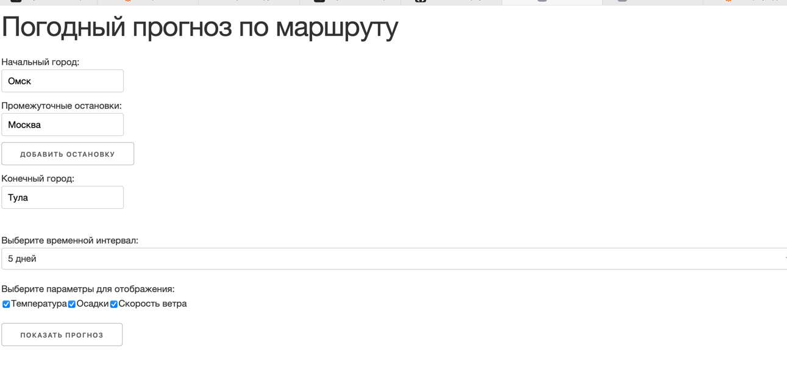
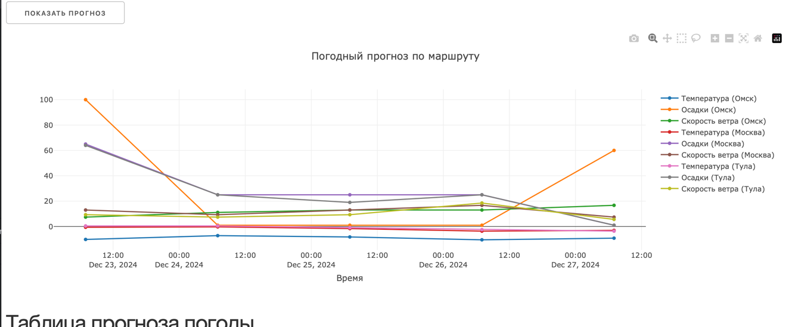
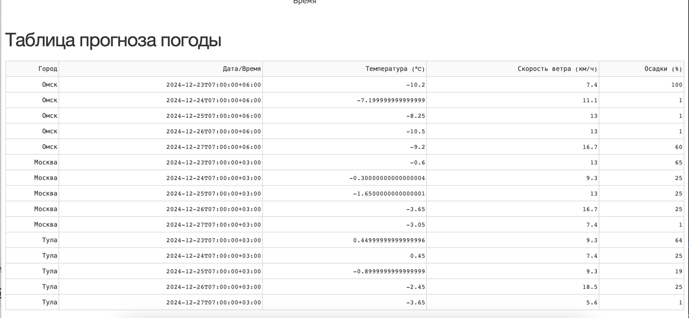
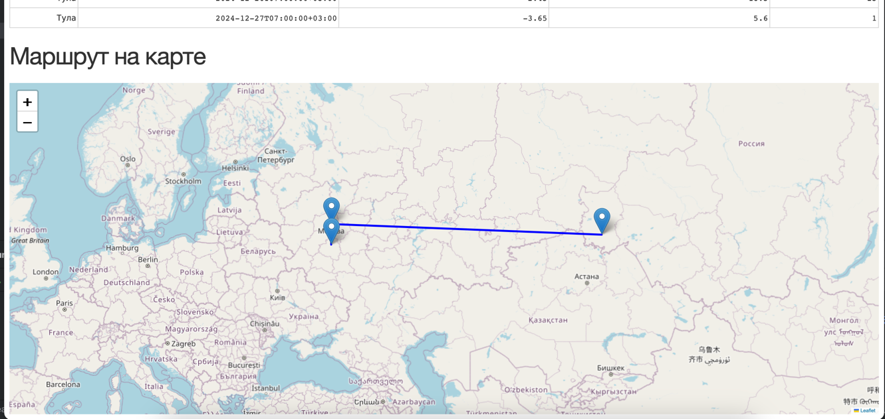

# Веб-сервис с прогнозом погоды для заданного маршрута

Этот проект представляет собой веб-приложение на базе Flask и Dash, которое предоставляет интерактивную визуализацию прогноза погоды для маршрута с несколькими точками. Пользователь может ввести начальный, конечный пункты и промежуточные остановки маршрута, чтобы получить прогноз погоды для всех указанных точек на интерактивной карте и графиках.

## Функционал

- Ввод начального и конечного пунктов маршрута.
- Возможность добавления промежуточных точек маршрута.
- Получение прогноза погоды на:
  - 12 часов,
  - 1 день,
  - 5 дней.
- Отображение прогноза в виде:
  - интерактивных графиков (температура, скорость ветра, вероятность осадков),
  - таблицы с подробными данными,
  - интерактивной карты с отметками для каждого пункта маршрута.
- Поддержка динамического добавления городов и обновления данных.

## Как работает приложение?

1. Пользователь вводит начальный, конечный города и, при необходимости, промежуточные остановки.
2. Приложение отправляет запросы к API [AccuWeather](https://developer.accuweather.com/) для получения погодных данных.
3. Прогноз погоды отображается:
   - в виде графиков (температура, осадки, скорость ветра),
   - на интерактивной карте с указанием погодных условий,
   - в таблице для каждого пункта маршрута.

## Используемые технологии

- **Backend**: Flask
- **Frontend**: Dash, Plotly
- **API**: AccuWeather
- **Визуализация**: Plotly, Dash Leaflet

## Требования

Перед началом работы убедитесь, что у вас установлено:

- Python 3.7 или выше
- Виртуальное окружение (`venv` или аналог)
- Установлены библиотеки:
  - Flask
  - Dash
  - Plotly
  - Dash Leaflet
  - requests

## Установка и запуск

### Шаг 1. Клонирование репозитория

Клонируйте репозиторий:
```bash
git clone https://github.com/ваш_профиль/ваш_репозиторий.git
cd ваш_репозиторий
```

### Шаг 2. Настройка окружения

Создайте виртуальное окружение:
```bash
python -m venv venv
source venv/bin/activate  # Windows: venv\Scripts\activate
```

Установите зависимости:
```bash
pip install -r requirements.txt
```

### Шаг 3. Настройка API ключа

Для работы с API необходимо указать ваш ключ в коде. Обновите значение `API_KEY` в файле `app.py`:
```python
API_KEY = "ваш_ключ_от_AccuWeather"
```

### Шаг 4. Запуск приложения

Запустите приложение:
```bash
python app.py
```

Приложение будет доступно по адресу: [http://127.0.0.1:5000/](http://127.0.0.1:5000/).

## Структура проекта

```
my_weather_project/
├── templates/             # HTML-шаблоны
├── static/                # Статические файлы (CSS, JS, изображения)
├── .gitignore             # Файлы/папки для исключения из git
├── app.py                 # Главный файл запуска приложения
├── dash_app.py            # Dash-приложение
├── README.md              # Описание проекта
└── requirements.txt       # Список зависимостей

```

## Пример использования

1. Откройте приложение в браузере.
2. Введите начальный и конечный города.
3. Добавьте промежуточные точки маршрута (если нужно).
4. Выберите временной интервал и параметры для отображения.
5. Просмотрите прогноз погоды на графиках, в таблице и на карте.




